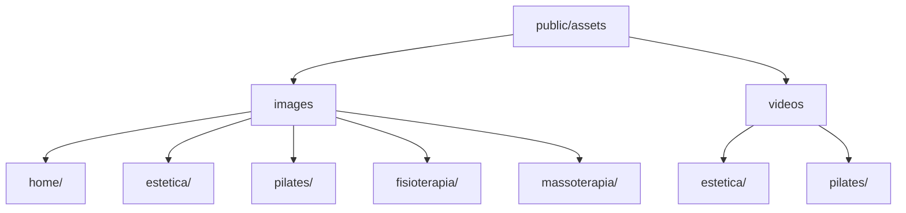

# Guia de Organização de Fotos e Vídeos

Para que as imagens e vídeos apareçam corretamente no site, você deve colocá-los nas pastas específicas dentro do projeto seguindo esta estrutura:

## 📁 Estrutura de Pastas

## 📝 Nomes dos Arquivos (Obrigatório)

Você deve renomear seus arquivos para os nomes abaixo antes de colocá-los nas pastas:

### 🏠 Home Page (Início)
- **Local:** `public/assets/images/home/`
- **Arquivo:** `sobre.jpg` (A foto da clínica que você me enviou)

### 💆‍♀️ Estética
- **Imagens:** `public/assets/images/estetica/`
- **Vídeo EXPLICATIVO:** `public/assets/videos/estetica/explicativo.mp4`

### 🧘‍♂️ Pilates
- **Imagens:** `public/assets/images/pilates/`
- **Vídeo EXPLICATIVO:** `public/assets/videos/pilates/explicativo.mp4`

---

## 🛠 Como fazer:
1. No seu computador, abra a pasta do projeto `genkiestetica`.
2. Navegue até `public` -> `assets` -> `images` ou `videos`.
3. Arraste as fotos para as pastas corretas.
4. **IMPORTANTE:** Certifique-se de que o nome está escrito exatamente como acima (ex: `sobre.jpg` em letras minúsculas).
